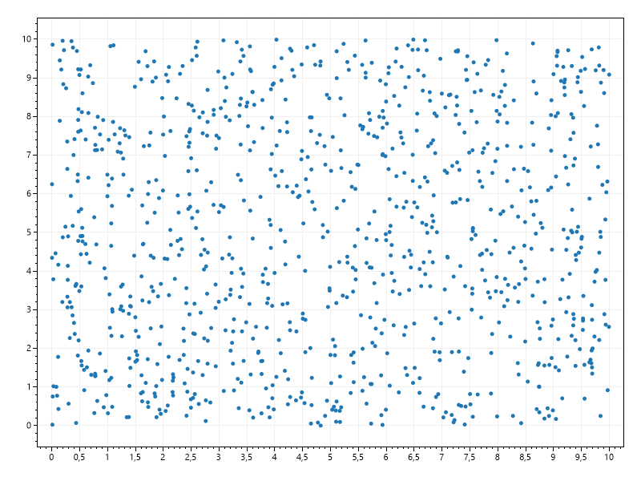
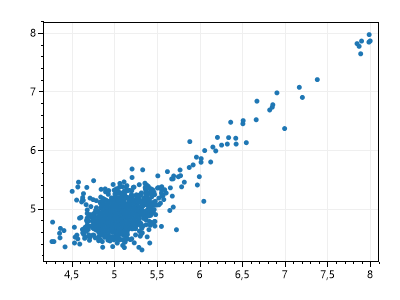
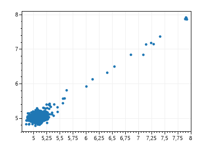
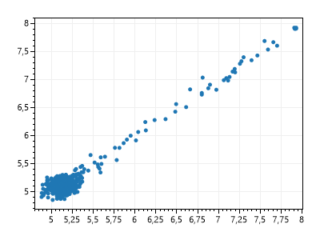
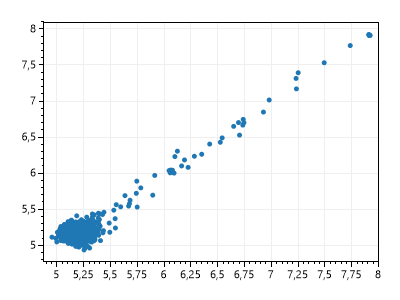
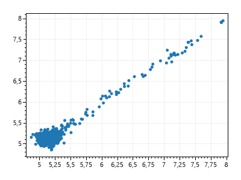

# GeneticAlgorithm
GeneticAlgorithm

## Installation

Download and install .Net Core 6 SDK [.Net Core Install instructions](https://dotnet.microsoft.com/en-us/download).
You can use any IDE you feel confortable editing, but Visual Studio is preferred.

## Executing
Execution:
````bash
$ dotnet run
````

----

# Execution
## Execution Parameters
| Parametro            	| Valor 	            |
|----------------------	|-------	            |
| Tamanho da população 	| 1000    	            |
| Forma de seleção     	| Roleta  	            |
| Tipo de crossover    	| Aritimetico 	        |
| Função objetivo      	| f(x1, x2)	            |
| Função de Fitness    	| f(x1, x2) + min       |
| Número de Gerações   	| 1000    	            |
| Taxa de Crossover    	| 100% + 5 Elites       |
| Taxa de Mutação      	| 0.5      	            |


## Execution Result Charts

### Initial Population


### Iteration 10 


### Iteration 100 


### Iteration 200 


### Iteration 500 


### Iteration 1000 



----

## Contributors

- Matheus Dutra Cerbino
- Eduardo Alves de Freitas

## ISSUES

If you have questions, concerns, bug reports, etc, please file an issue in this repository's Issue Tracker.

----

## Credits and references

1. Project made as a homework for "Artificial Inteligency" class of CEFET-MG college.
2. Project GitHub [GitHub](https://github.com/Pinacolada8/GeneticAlgorithm)
